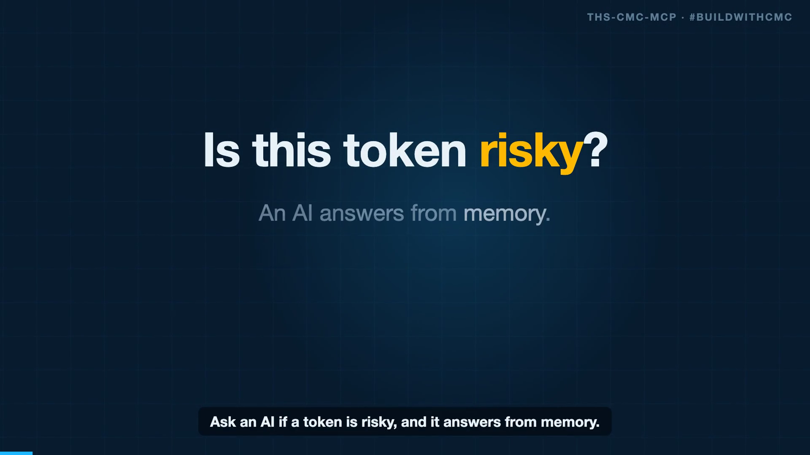
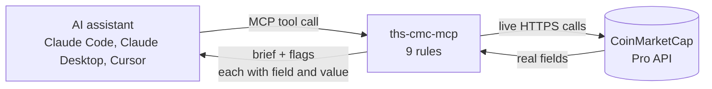
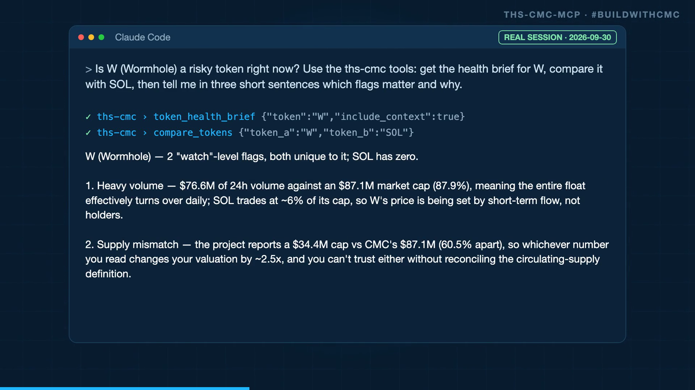
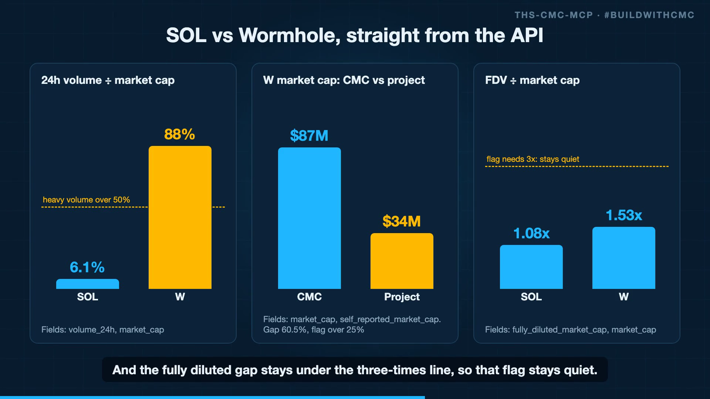
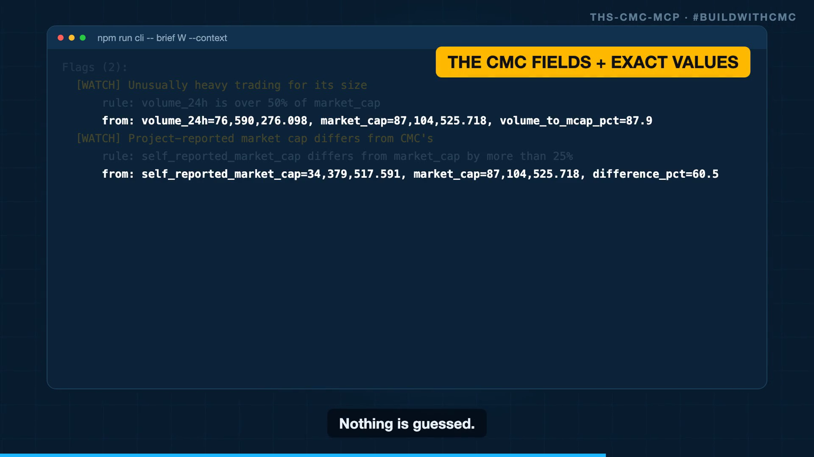

<div align="center">

# ths-cmc-mcp

### Give any AI assistant a live, sourced token health brief.

**Every risk flag shows the CoinMarketCap field and the exact value behind it.**

[](https://dorahacks.io/hackathon/coinmarketcap-api-202609/detail)
[](https://modelcontextprotocol.io)
[](#tests)
[](tsconfig.json)
[](#license)

<a href="demo/demo.mp4">
  
</a>

**[Watch the 75 second demo](demo/demo.mp4)** &nbsp;|&nbsp; **[Quick start](#quick-start)** &nbsp;|&nbsp; **[The nine rules](#the-nine-rules)** &nbsp;|&nbsp; **[Real output](#real-output)**

</div>

---

## Why this exists

Ask an AI whether a token is risky and it answers from memory. No source, no field, no proof. Raw market APIs go the other way: hundreds of fields and no judgment.

`ths-cmc-mcp` sits in the middle. It is an [MCP](https://modelcontextprotocol.io) server that calls the **CoinMarketCap Pro API live**, applies **nine plain rules**, and hands your assistant a short brief. Each flag lists the rule, the CMC fields, and the values. If a field is missing, it says so. It never guesses.

> I built it for the [Build with CMC: API Hackathon](https://dorahacks.io/hackathon/coinmarketcap-api-202609/detail) (track: AI Agents and Automation). It is a new, standalone tool written for this event. It is separate from the [Token Health Scan](https://tokenhealthscan.com) scanner and does not use or claim that scanner's score.

## How it works



### Three tools

| Tool | What you get |
|---|---|
| `token_health_brief` | Price, market cap, FDV, volume, supply, rank, and risk flags for a token by symbol (`SOL`) or contract address |
| `market_context` | Fear & Greed index, global market cap and volume, BTC and ETH dominance |
| `compare_tokens` | Two briefs side by side, with shared flags and flags that differ |

A CLI wraps the same code, so you can run it without an MCP client. It prints the real API calls before the brief.

## See it work in a real MCP client

I attached the server to **Claude Code** and asked: *"Is W (Wormhole) a risky token right now?"* Claude found the tools, called `token_health_brief` and `compare_tokens`, and answered from live CMC data. The recorded session is in [`demo/outputs/claude-session.json`](demo/outputs/claude-session.json).

<div align="center">
  
</div>

### What the data looked like

SOL is large and liquid, so no flags fire. Wormhole (W) fires two. Its fully diluted gap stays under the 3x line, so that flag stays quiet. A tool that flags everything is useless, so the quiet flag is on purpose.

<div align="center">
  
</div>

## Quick start

```bash
git clone https://github.com/gmangabeira/ths-cmc-mcp
cd ths-cmc-mcp
npm install
export CMC_API_KEY=your_key_here     # free key: https://coinmarketcap.com/api

npm run cli -- brief SOL
npm run cli -- brief W --context
npm run cli -- brief 0xdAC17F958D2ee523a2206206994597C13D831ec7
npm run cli -- compare SOL W
```

<details>
<summary><b>Add it to Claude Code, Claude Desktop or Cursor</b></summary>

```json
{
  "mcpServers": {
    "ths-cmc": {
      "command": "npx",
      "args": ["tsx", "/absolute/path/to/ths-cmc-mcp/src/server.ts"],
      "env": { "CMC_API_KEY": "your_key_here" }
    }
  }
}
```

Then ask: *"Give me a health brief for W and tell me which flags matter."*

</details>

| Client | Works? |
|---|---|
| Claude Code, Claude Desktop, Cursor, any local stdio MCP client | Yes |
| ChatGPT and other clients that accept only **remote** (HTTP) MCP servers | Not yet. This server speaks stdio only. A Streamable HTTP transport is the next step. |

## The nine rules

Each flag lists the rule, the CMC fields, and the values. Thresholds are my rules of thumb, not findings.

| Flag | Fires when | CMC fields |
|---|---|---|
| `fdv_gap` | FDV is 3x or more of market cap (10x = high) | `fully_diluted_market_cap`, `market_cap` |
| `thin_trading` | 24h volume under 1% of market cap (under 0.1% = high) | `volume_24h`, `market_cap` |
| `heavy_volume` | 24h volume over 50% of market cap | `volume_24h`, `market_cap` |
| `supply_mismatch` | Self-reported market cap differs from CMC's by over 25% | `self_reported_market_cap`, `market_cap` |
| `few_venues` | Under 10 market pairs | `num_market_pairs` |
| `dex_heavy` | DEX share of volume over 80% | `dex_volume_24h`, `volume_24h` |
| `young_token` | Listed under 90 days ago (under 30 = high) | `date_added` |
| `sharp_drop` | 7 day change under -30% (under -50% = high) | `percent_change_7d` |
| `cmc_notice` | CMC shows a notice (info only, never scored as risk) | `info.notice` |

## Real output

A live run on 2026-09-30. Nothing here is mocked.

<details open>
<summary><b><code>npm run cli -- brief W --context</code></b></summary>

```text
CMC API calls made:
  GET /v2/cryptocurrency/quotes/latest?symbol=W&convert=USD&skip_invalid=true  ->  HTTP 200, 1 credit, 435 ms
  GET /v2/cryptocurrency/info?id=29587  ->  HTTP 200, 1 credit, 198 ms
  GET /v3/fear-and-greed/latest  ->  HTTP 200, 1 credit, 373 ms
  GET /v1/global-metrics/quotes/latest  ->  HTTP 200, 1 credit, 376 ms

Wormhole (W)  rank 269  listed 2024-03-29
Price $0.0133   Market cap $87.10M   FDV $133.36M
Volume 24h $76.59M   DEX volume $104,925.65   Pairs 415
Change 24h -3.3%   7d 19.5%   30d 46.6%

Flags (2):
  [WATCH] Unusually heavy trading for its size
      rule: volume_24h is over 50% of market_cap
      from: volume_24h=76,590,276.098, market_cap=87,104,525.718, volume_to_mcap_pct=87.9
  [WATCH] Project-reported market cap differs from CMC's
      rule: self_reported_market_cap differs from market_cap by more than 25%
      from: self_reported_market_cap=34,379,517.591, market_cap=87,104,525.718, difference_pct=60.5

Market mood: Fear & Greed 67 (Greed)

Market-data signals from CoinMarketCap. Not the Token Health Scan on-chain scan. Not financial advice.
```

</details>

<div align="center">
  
</div>

## CMC API endpoints used

| Endpoint | Used for |
|---|---|
| `GET /v2/cryptocurrency/quotes/latest` | Price, market cap, FDV, volume (CEX and DEX), supply, pairs, date added, rank |
| `GET /v2/cryptocurrency/info` | Token identity, category, links, contract address, CMC `notice`, and address lookup |
| `GET /v3/fear-and-greed/latest` | Market mood |
| `GET /v1/global-metrics/quotes/latest` | Global market cap, volume, dominance |

## What the API made possible, and where it got in the way

**What worked well.** One `quotes/latest` call returns market cap, FDV, CEX volume, DEX volume, pair count, date added and the project's own self-reported market cap. That covers eight of my nine rules from a single request. The `self_reported_market_cap` field was the best find: comparing it with CMC's own market cap is a cheap cross-check, and it is what flagged Wormhole.

<details>
<summary><b>Where it got in the way (API feedback for the CMC team)</b></summary>

1. **Address lookup rejects checksummed addresses.** `info?address=0xdAC1...` returns `400 Invalid value for 'slug': 'null'`. The same address in lowercase works. The error message points at the wrong parameter. I lowercase EVM addresses before calling.
2. **`error_code` is a string on some endpoints.** `/v3/fear-and-greed/latest` returns `"0"`, while v1 and v2 return the number `0`. A strict `!== 0` check treats success as failure.
3. **Symbols collide.** `quotes/latest?symbol=X` returns a list, and several active tokens can share one symbol. I pick the lowest `cmc_rank`. Passing a contract address avoids the guess.
4. **`market-pairs/latest` returned 403** (error 1006) on the plan I used, so I could not add per-exchange concentration checks.
5. **The DEX quotes endpoint returned an empty list** for the one address I tried, so I left it out rather than ship something I could not verify.
6. **`notice` is free text.** One example: WLD carries a note about analytics coverage on World Chain. It is useful context but not a risk signal, so I show notices as info only.

</details>

## Tests

```bash
npm test          # 19 tests: rule thresholds, recorded real CMC responses, mocked pipeline
npm run smoke     # live: starts the MCP server and calls every tool against the real CMC API
```

Fixtures in `tests/fixtures/` are real recorded responses (no key, no headers). `scripts/capture-fixtures.mts` re-records them. `scripts/secret-sweep.sh` checks that the API key appears nowhere in the repo.

## Project layout

```text
src/
  cmc.ts        CoinMarketCap client: rate-limit guard, call evidence, never logs the key
  flags.ts      The nine rules. Each flag carries its fields and values
  brief.ts      Token lookup, brief builder, compare, text formatter
  server.ts     MCP server (stdio): three tools
  cli.ts        CLI wrapper that prints the real API calls
tests/          Unit tests, recorded fixtures, live smoke test
demo/           Demo video, recorded outputs, and the code that builds the video
docs/           PRD and README images
```

## Limits

- **Market data only.** It does not read the chain, holders, contracts or liquidity locks. The full on-chain scan is [Token Health Scan](https://tokenhealthscan.com).
- **Thresholds are rules of thumb.** A flag is a reason to look closer, not a verdict.
- **One process, one rate limiter.** The client keeps under 45 calls a minute per process. Several processes at once can share a 50 per minute plan limit and hit a 429.
- Not financial advice.

## License

MIT. Built by [Gabriel Mangabeira](https://mangabeira.net), founder of [Token Health Scan](https://tokenhealthscan.com).

The demo voiceover is AI-generated text to speech. The Claude Code session shown is a real recording.
